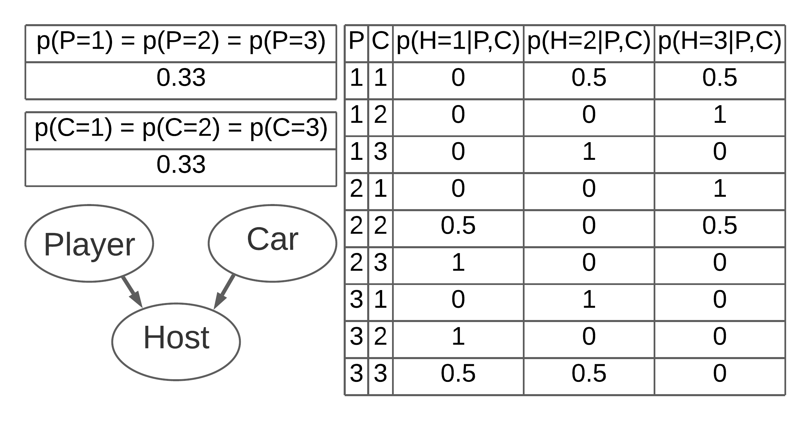
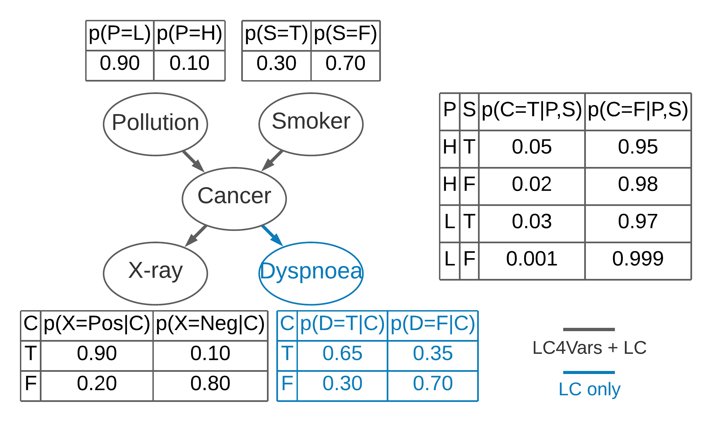
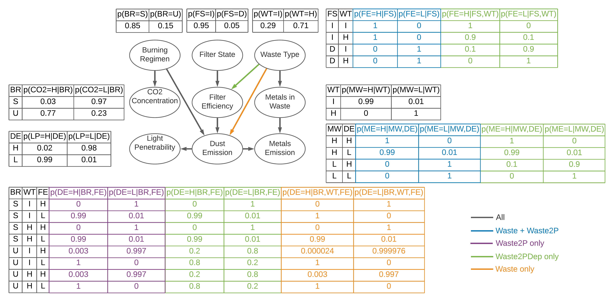
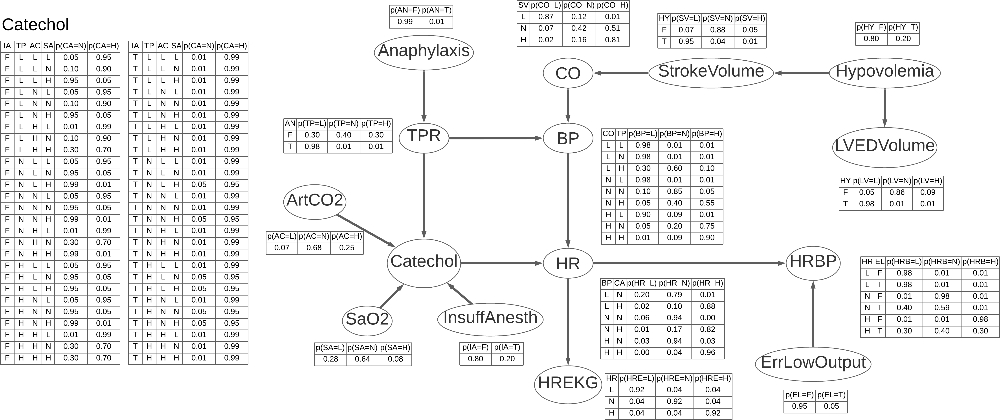

# Bayesian Network Structure Learning with Quantum Annealing implementation

## Introduction
This work is a python implementation of [O'Gorman et al.](https://doi.org/10.1140/epjst/e2015-02349-9) **Bayesian Network Structure Learning** encoding into a **Quadratic Unconstrained Binary Optimisation** (**QUBO**) problem.
The encoded **QUBO** problem is solved using either a **Simulated Annealing** or **Quantum Annealing** approach using the libraries and **quantum annealers** provided by [D-Wave Systems](https://www.dwavesys.com/).

## Installation

First of all, clone the repository and enter the folder.

```
git clone https://github.com/massimo-rizzoli/BNSL-QA-python.git
cd BNSL-QA-python
```

### Python Environment

#### With Pyenv

Create a python 3.9.7 virtual environment named `bnslqa-env`

```
pyenv virtualenv 3.9.7 bnslqa-env
```

Set the `bnslqa-env` environment as the local environment for the `BNSL-QA-python` folder (the environment will be automatically activated when entering the folder)

```
pyenv local bnslqa-env
```

Update `pip`

```
python -m pip install -U pip
```

Install the requirements

```
pip install -r requirements.txt
```

#### With Python Venv

The project was developed with `python 3.9.7`, so it is recommended to use this version.

Create a python virtual environment named `bnslqa-env`

```
python -m venv bnslqa-env
```

Activate the `bnslqa-env` environment

```
source bnslqa-env/bin/activate
```

Update `pip`

```
python -m pip install -U pip
```

Install the requirements

```
pip install -r requirements.txt
```

**Note:** if using python venv, each time you open a shell, you will have to manually activate the environment as shown above, before being able to use the project.

### D-Wave

This section is necessary to be able to solve problems using *Quantum Annealing*. The *Exaustive Search* and *Simulated Annealing* strategies are always available.

If you do not have one already, create an account on [D-Wave Leap](https://cloud.dwavesys.com/leap/signup/), then proceed with the configuration by running the following command

```
dwave setup
```

You will be asked for several settings, but you can just leave the default. At a certain point you will be prompted for an `Authentication Token`, which can be found on your [D-Wave Leap Dashboard](https://cloud.dwavesys.com/leap/).

For further information, you can visit D-Wave's page on [Installing Ocean Tools](https://docs.ocean.dwavesys.com/en/stable/overview/install.html#set-up-your-environment).

## Usage

To show the general help for the module, run

```
python -m bnslqa --help
```

### Dataset Generation

The estimation of a Bayesian Network's structure starts from examples in the form of configurations of its variables. To the purpose of dataset generation the `generate` submodule can be used.

To show the help message, run

```
python -m bnslqa generate --help
```

The following command will generate an `expected` dataset (i.e. ideally with no variance), containing `SIZE` examples, saved as `datasets/NAME.txt`, for the problem defined in the `PROBLEM_DEFINITION_PATH` json file

```
python -m bnslqa generate \
  PROBLEM_DEFINITION_PATH \
  --size SIZE \
  --expected \
  --name NAME
```

Problem definition json files for the datasets used in the experiments can be found in the `problems` folder.

**Note:** for *expected* datasets the number of generated examples might not be exactly `SIZE`.
This is due to the fact that for each configuration of variables with probability *p*, a number  `round(p*SIZE)` of examples for that configuration will be generated.
If *p* is small enough with respect to `SIZE`, the number of examples will equate to zero, and with many such low-probability configurations, the actual size may differ from `SIZE`.
To reduce the effect, choose larger `SIZE` if necessary when generating *expected* datasets.
Instead, for *non-expected* datasets (i.e. with non-zero variance) a number of exactly `SIZE` examples will always be generated.

### Run Solvers

The Bayesian Network's structure can be estimated starting from a dataset, with three different approaches: *Exaustive Search*, *Simulated Annealing*, or *Quantum Annealing*. To this purpose the `solve` submodule can be used.

To show the help message, run

```
python -m bnslqa solve --help
```

The following command will estimate the structure of the Bayesian Network relative to the txt dataset file `DATASET_PATH`, by using strategy `STRATEGY` (which can be `ES`, `SA`, `QA`), performing `READS` reads each of which consisting of `TIME` microseconds of annealing time.

```
python -m bnslqa solve \
  DATASET_PATH \
  STRATEGY \
  --reads READS \
  --anneal TIME
```

Datasets used for the experiments can be found in the release.

**Note:** `--anneal TIME` is considered only for the `QA` strategy and `--reads READS` is considered only for `SA` and `QA`. The `ES` strategy performs an exhaustive search once, choosing the lowest-valued (best) solution.

## New Problem Definition

You may want to define a new problem.
This is possible by defining a json file for the new problem with the appropriate structure.

We will take the *Monty Hall Problem* as an example.



The json object will have to contain three elements:

- a string `"name"` defining the name of the problem;
- an object `"variables"` containing the specification of problem variables;
- an array `"solution"` containing the adjacency matrix of the ground truth Bayesian Network structure.

It follows the content of `datasets/MHP.json` which defines the problem

```
{
  "name": "MHP",
  "variables": {
    "player":{
      "states": ["1","2","3"],
      "parents": [],
      "cpt": [0.33, 0.33]
    },
    "host":{
      "states": ["1","2","3"],
      "parents": ["player","car"],
      "cpt": [[ [0.00, 0.50], [0.00, 0.00], [0.00, 1.00] ],
              [ [0.00, 0.00], [0.50, 0.00], [1.00, 0.00] ],
              [ [0.00, 1.00], [1.00, 0.00], [0.50, 0.50] ]]
    },
    "car":{
      "states": ["1","2","3"],
      "parents": [],
      "cpt": [0.33, 0.33]
    }
  },
  "solution": [ [0,1,0],
                [0,0,0],
                [0,1,0] ],
  "toporder": [
    "player",
    "car",
    "host"
  ]
}
```

**Note:** the `"toporder"` array explicitly defines which topological ordering of the variables should be used when generating the dataset.
Its only purpose is to have the dataset generated in the exact same way (examples in the same order) as it was with the method used for the experiments.
The reason behind it is to have the same exact datasets that were used in the experiments.
***It is not necessary to specify such an ordering*** for new problems, since a topological order will be automatically calculated and will always be the same for a given problem.


### Defining "variables"

For each Bayesian variable, the `"variables"` object must contain an object defining the variable, identified by the variable's name.
In the case of the *Monty Hall Problem* the variables are `"player"`, `"host"`, and `"car"`.

Each variable must contain three arrays:

- `"states"`, containing all the possible states for the variable;
- `"parents"`, containing all of its parent names (identifiers of the other variables);
- `"cpt"`, the conditional probability table for the variable.

**Note:** the order in which the variables appear in `"variables"` is the order used for `"solution"` and the order in which the variable realisations will be listed in each example in each dataset generated from the problem.

The conditional probability table `"cpt"` is structured as follows: the first dimension refers to the states of the first parents, the second to the states of the second parent, and so on, while the last dimension refers to the states of the variable which owns `"cpt"`. The last dimension does not contain the last state for the variable, since it can be computed as 1 minus the sum of the others.

E.g.: considering the variable `"host"` and its conditional probability table, `cpt[0][2][1]` has value `1.00`, meaning that the probability of the *host choosing door 1* (`1`), given that the *player chose door 0* (`0`) and the *car was behind door 1* (`1`), is equal to `1.00` (p(host=1 | player=0, car=2) = 1.00).

### Defining "solution"

The `"solution"` array should just be the adjacency matrix representing the ground truth structure for the Bayesian Network.

The order for the variables is the one in which they appear in `"variables"`: e.g. in the case above, `solution[0][1]` having value `1` means that there is an arc from the variable `"player"` (`0`) to the variable `"host"` (`1`).

**Note:** the order is in no way influenced by the `"toporder"` array.

## Problems Used
Together with the *Monty Hall Problem* listed above, the other problems are: *Lung Cancer*, *Waste*, and *Alarm*.







